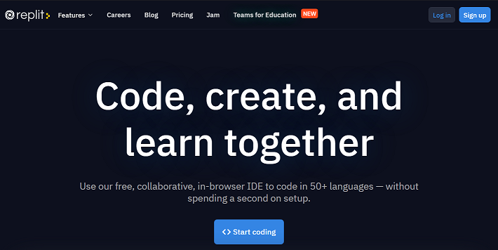
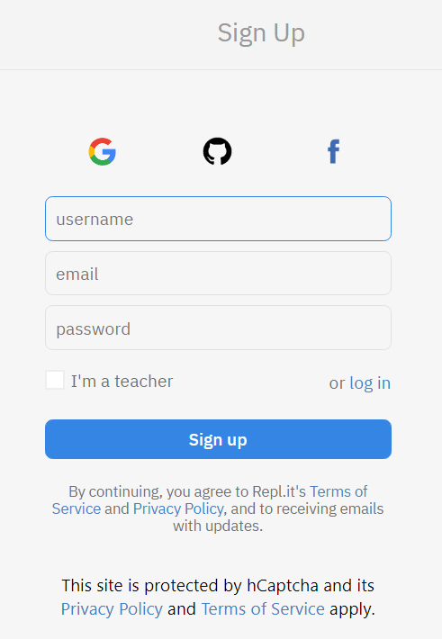
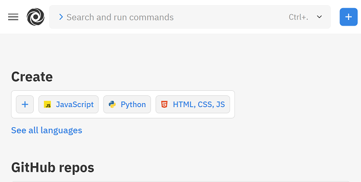
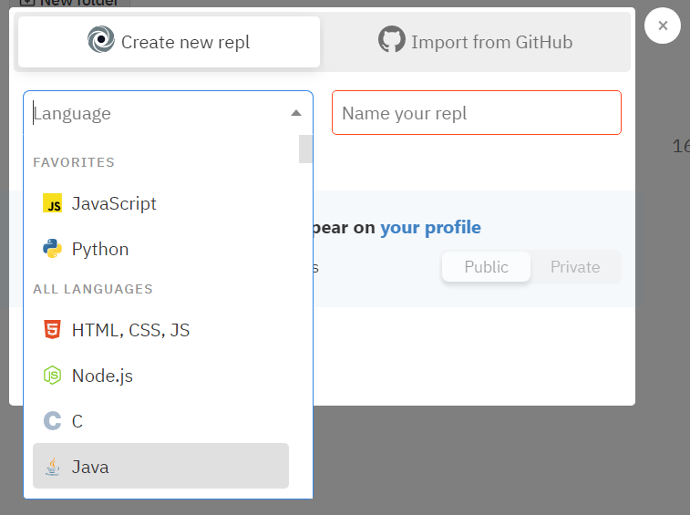
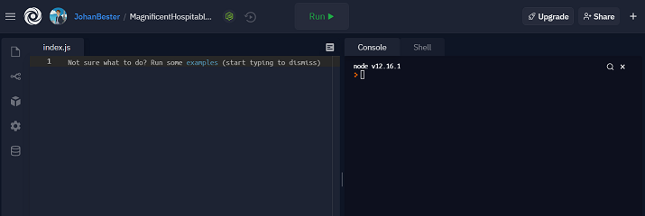

# Setting up a Replit Development Environment

## **1. Sign-up for [Replit](https://repl.it/) by clicking on this link.**

You should see a welcome screen much like this one.

- If you have already created an account login, else click the **`signup`** Button.

 

## **2. To Sign Up for a new account there are several options. You can sign up with your...**

- Google account
- GitHub account
- Facebook account
- Or with an email and password.

> Note: It's suggested that you use the same email address you used for all the other accounts you created for this Bootcamp.

Follow the setup dialog to fill out your profile, and select your coding languages.

You probably want to choose -- JavaScript, Node.js, HTML & CSS & JS

 

## **3. On the Replit home screen there are several ways to create a new Replit.**

On the left side menu bar there is a button to "Create Replit", and on the main page are there are several "Plus" buttons or the language buttons to click on.

 

## **4. A menu will pop up to choose a language if one has not been chosen, and the new Replit can be named here as well.**

 

## **5. The Replit work space has 2 panels -- the code space on the left, and the console/shell on the right.**

To run your code in the console, simply click the green run arrow.

 

> ### [Click here to learn more about the Repl.it IDE.](https://repl.it/site/ide)
